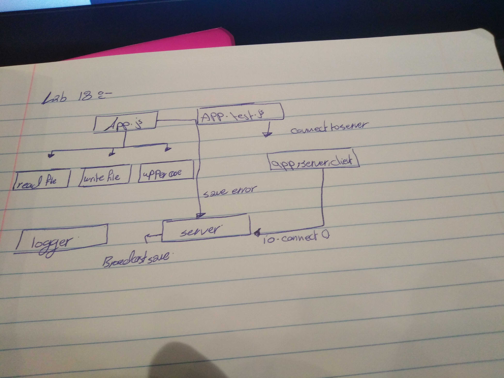

# lab-18-socket.io
:computer: :computer: Socket.io Create an event driven application that simulates the basic functionality of grading an assignment using 2 client applications connected to a server hub via Socket.io, using only events to trigger actions

### Author: Sohad qtaitat

### Links and Resources

- [submission PR](https://github.com/401-advanced-javascript-sohad/lab-18-socket.io/pull/1)
- [ci/cd](https://github.com/401-advanced-javascript-sohad/lab-18-socket.io/runs/473279752?check_suite_focus=true) (GitHub Actions)

### Setup
npm i jest eslint

#### How to initialize/run your application (where applicable)

- `npm test`

#### Tests

- How do you run tests?
     - 'npm test'
- Any tests of note?
     - jest --verbose --coverage
- Describe any tests that you did not complete, skipped, etc
     - evey test solved and another time i will cover more cases.

#### UML
Link to an image of the UML for your application and response to events

